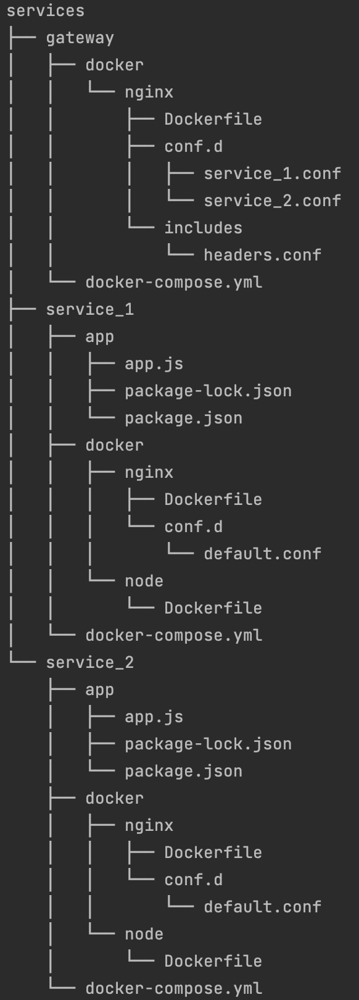

# NGINX Reverse Proxy with docker services

## Project structure


## Commands
```bash
# run all services
$ make init
```
```bash
# stop all services
$ make down
```
```bash
# build service images (with use cache)
$ make build
```
```bash
# force rebuild service images
$ make rebuild
```

## Access to services
* [Service 1][service_1]
* [Service 2][service_2]

[service_1]: http://localhost:8080
[service_2]: http://localhost:8081
